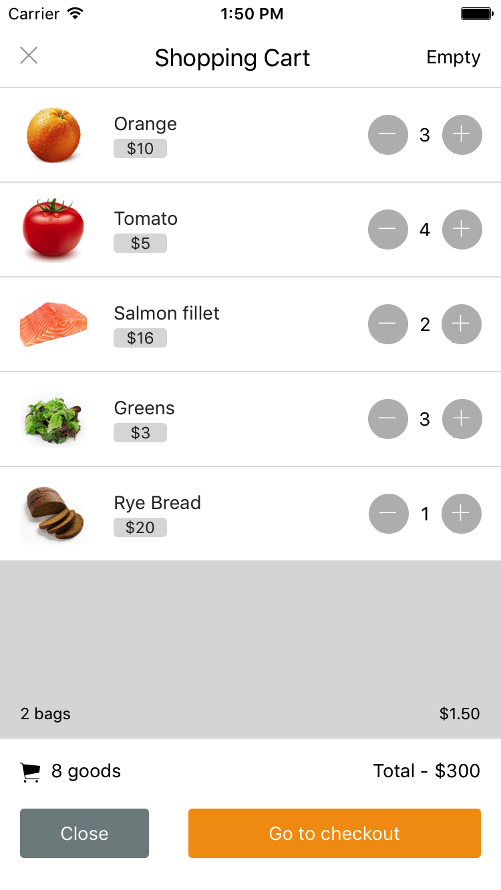

# react-native-cart
A shopping cart component for React Native

# Screenshot of the UI

# Getting Started
1. Clone this repo unto your local machine using the following command: `git clone https://github.com/Chiamaka/react-native-cart.git`
2. cd into the repo: `cd react-native-cart`
3. run `npm install` to install the dependencies needed to run the code effectively
4. Run on your iOS or Android simulator using `react-native run-ios` or `react-native run-android` respectively.

# Contributing
[Check this](http://www.chiamaka.xyz/blog/post/ui-mockup-created/)
